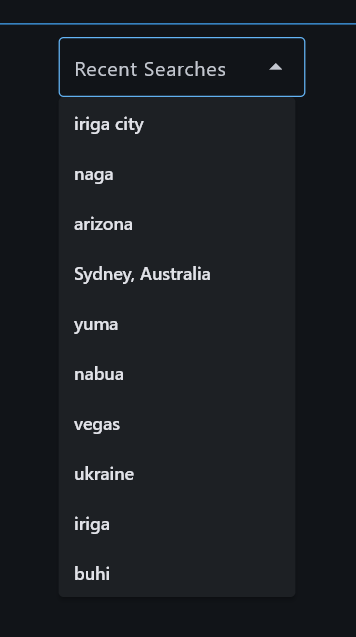
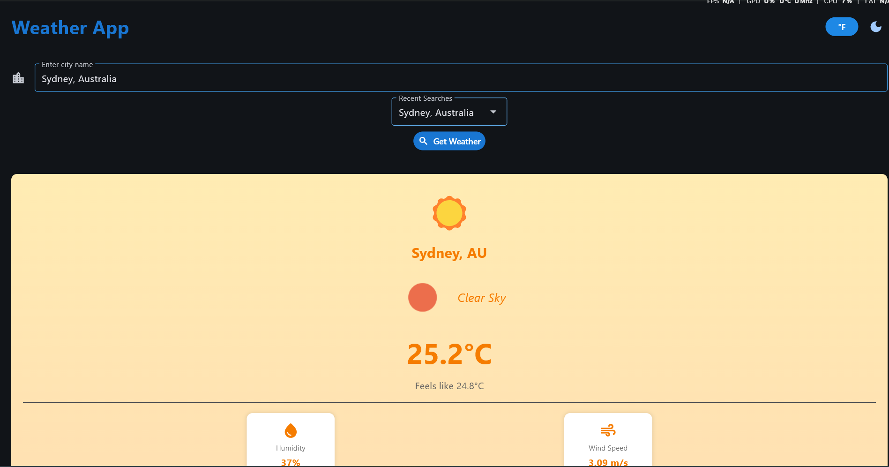

# Weather Application - Module 6 Lab

## Student Information
- **Name**: [Sabio Jacob Angel M.]
- **Student ID**: [231002340]
- **Course**: CCCS 106
- **Section**: [BSCS3B]

## Project Overview
[The Weather App is a modern desktop application built with Python and Flet that delivers real-time weather information for cities worldwide. Users can search any location to view temperature, humidity, wind speed, and current conditions powered by the OpenWeatherMap API.
The app features an intelligent search history that saves your last 10 searches for quick access, and a temperature toggle allowing instant conversion between Celsius and Fahrenheit. What sets this app apart is its dynamic theming system—the interface automatically changes colors, gradients, and emojis based on weather conditions, displaying warm tones for sunny days, blues for rain, purples for storms, and cool hues for snow.
With smooth animations, light/dark mode support, and persistent data storage for preferences and history, the app provides an intuitive and visually engaging weather-checking experience perfect for daily use.]

## Features Implemented

### Base Features
- [x] City search functionality
- [x] Current weather display
- [x] Temperature, humidity, wind speed
- [x] Weather icons
- [x] Error handling
- [x] Modern UI with Material Design

### Enhanced Features
1. **[Search History]**
   - Automatically saves the last 10 searched cities to a JSON file and displays them in a dropdown menu for quick re-searching. The history removes duplicates and keeps the most recent searches at the top, providing easy access to frequently checked locations.

   - This feature significantly improves user experience by eliminating repetitive typing for frequently checked cities. It's particularly useful for users who monitor weather in multiple locations regularly (like travelers, remote workers, or people with family in different cities).

   - CThe main challenge was handling file I/O errors when the JSON file didn't exist or was corrupted. I solved this by implementing try-catch blocks in the `load_history()` method that gracefully return an empty list if the file is missing or contains invalid JSON, ensuring the app never crashes on startup

2. **[Temperature Unit Toggle]**
   - Provides a button that instantly converts all displayed temperatures between Celsius and Fahrenheit without re-fetching data from the API. The user's preference is saved to a JSON file and automatically loaded on app restart, maintaining consistency across sessions

   -  Different regions use different temperature units, and users traveling or checking weather internationally need flexibility. This feature makes the app globally accessible and user-friendly for both metric and imperial system users without requiring manual conversion

   - Initially, the toggle button wasn't updating the display properly due to incorrect async function handling. I solved this by creating a dedicated `redisplay_weather()` method that properly calls the async `display_weather()` function using `page.run_task()`, and added an `animate` parameter to skip fade animations during unit switching for smoother UX

3. **[Dynamic Weather Themes with Color Adaptation]**
   -  Automatically changes the entire UI's color scheme, including backgrounds, text colors, gradients, and weather emojis based on current conditions (sunny, rainy, cloudy, snowy, thunderstorm, etc.). The system detects day/night cycles and applies 8+ unique weather-specific themes with smooth transitions

   -  Visual representation enhances user understanding and engagement. Instead of just reading "rainy," users immediately feel the atmosphere through blue tones and rain emojis. This creates an immersive, intuitive experience that makes weather information more memorable and engaging.

   - The challenge was coordinating colors across multiple UI elements (container backgrounds, text, icons, cards) while maintaining readability and accessibility. I solved this by creating a centralized `get_weather_colors()` method that returns a complete theme dictionary with coordinated colors, ensuring consistency. I also implemented gradient backgrounds and used Flet's animation system with a 300ms transition for smooth color changes between weather updates.

## Screenshots
**Search History:**


**Temperature Toggle:**


**Dynamic Themes:**



## Installation

### Prerequisites
- Python 3.8 or higher
- pip package manager

### Setup Instructions
```bash
# Clone the repository
git clone https://github.com/hammertime7wdc/cccs106-projects.git
cd cccs106-projects/mod6_labs

# Create virtual environment
python -m venv venv
source venv/bin/activate  # On Windows: venv\Scripts\activate

# Install dependencies
pip install -r requirements.txt

# Create .env file
cp .env.example .env
# Add your OpenWeatherMap API key to .env